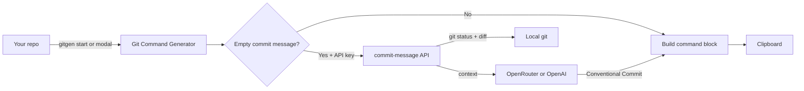

<div align="center">

# Git Command Generator

**Type it, copy it, done.**

A local Next.js tool that builds ready-to-paste Git workflows — and generates Conventional Commit messages with AI from your real `git diff`.

<p>
  
  
  
  
  
  
</p>

<p>
  <a href="#quick-start"><strong>Quick Start</strong></a> ·
  <a href="#features"><strong>Features</strong></a> ·
  <a href="#ai-commit-generation"><strong>AI Commits</strong></a> ·
  <a href="#cli"><strong>CLI (`gg`)</strong></a> ·
  <a href="#security"><strong>Security</strong></a>
</p>

</div>

---

## Why this exists

Git is powerful. Remembering every flag and sequence is not.

**Git Command Generator** gives you multi-step command blocks for everyday workflows — commit, push, branch, merge, stash, restore — in one click. Leave the commit message empty and AI reads your local diff to write a short Conventional Commit for you.

No accounts. No cloud repo access. Just your machine, your folder, your terminal.

---

## Features

<table>
<tr>
<td width="50%" valign="top">

### Ready-made workflows

Copy full command sequences for:

- First push & remote setup
- Commit + push
- Commit only (no push)
- Create branch
- Merge into `main`
- Save state & switch back
- Checkout any branch
- Restore all files or one file

Each card shows live output as you type.

</td>
<td width="50%" valign="top">

### AI commit messages

- Reads `git status`, name-status, and diff from **your** project folder
- OpenRouter **or** OpenAI (server key or UI)
- Conventional Commits format (`feat:`, `fix:`, `chore:`, …)
- English or Portuguese output
- 12s in-memory cache — no duplicate API hits when clicking multiple cards

</td>
</tr>
<tr>
<td width="50%" valign="top">

### Developer ergonomics

- One-click copy on every card
- Recent folders in `localStorage`
- Folder picker modal on first launch
- Terminal CLI: `gg` / `gitgen` — short commands (`gg c p`, `gg b …`) or long forms
- `gg start` opens the app with `?path=` from any repo
- Collapsible sections, field validation, 30s message auto-clear

</td>
<td width="50%" valign="top">

### Local-first

- Runs on `localhost:2001`
- API route executes `git` on your filesystem
- Preferences stored in the browser
- Keys stay in `.env.local` or localStorage — never in git

</td>
</tr>
</table>

---

## How it works



1. Point the app at your project folder.
2. Make changes in your real repo.
3. Click **Copy** on a workflow card.
4. Paste into your terminal. Done.

---

## Quick start

### Install the CLI (recommended)

Requires [Node.js 18+](https://nodejs.org) and Git on your `PATH`.

```bash
npm install -g git-command-generator
```

This puts **`gitgen`** and **`gg`** on your PATH. First AI use runs an OpenRouter setup wizard (API key + model). You can also run:

```bash
gitgen setup
gitgen config              # show key (masked), model, language
gitgen config set model google/gemini-2.0-flash-001
gitgen update              # check npm / install latest
```

User config is stored outside the repo:

| OS | Path |
|----|------|
| Windows | `%APPDATA%\gitgen\config.json` |
| macOS | `~/Library/Application Support/gitgen/config.json` |
| Linux | `~/.config/gitgen/config.json` |

Env overrides (optional): `OPENROUTER_API_KEY`, `OPENROUTER_MODEL`, `COMMIT_LANGUAGE`, `GITGEN_CONFIG_DIR`.

### Web app (local development)

```bash
git clone https://github.com/MusicMaster4/git-command-generator.git
cd git-command-generator
npm install
cp .env.example .env.local   # optional server keys for the Next.js app
npm run dev
```

Open **[http://localhost:2001](http://localhost:2001)**.

### Scripts

| Command | What it does |
|---------|--------------|
| `npm run dev` | Dev server on port **2001** |
| `npm run build` | Production build (web) |
| `npm run build:cli` | Build Node CLI → `dist/cli.js` |
| `npm run start` | Serve the web build (port 2001) |
| `npm run lint` | ESLint |
| `npm run typecheck` | TypeScript check |
| `npm test` | Unit tests (config + update logic) |
| `npm run here` | Open app with **current directory** (`?path=`) |
| `gg` / `gitgen` | CLI on PATH after global install — see [CLI](#cli) |

### Releases

Push to `main` runs `.github/workflows/release.yml`: patch bump, tag, GitHub Release, and `npm publish` when the `NPM_TOKEN` secret is set. Commits with `[skip release]` or messages starting with `chore(release):` do not publish (anti-loop).

---

## CLI

Run Git Command Generator from **any** project folder via **`gg`** or **`gitgen`** (same binary).

| Launcher | Notes |
|----------|--------|
| `gg` | Short name (recommended) |
| `gitgen` | Full name |

Bare `gg` / `gitgen` (no arguments) prints **help** — it does **not** open the app.

### Install

```bash
npm install -g git-command-generator
# update later:
npm update -g git-command-generator
# or:
gitgen update
```

From a clone (local PATH via `scripts/*.cmd` on Windows), run `npm run build:cli` once so `dist/cli.js` exists, then add `scripts/` to PATH if you want the wrappers.
### Open the web app

```bash
gg start
# same as: gitgen start
```

| Server state | Behavior |
|--------------|----------|
| Already running on `localhost:2001` | Opens the browser with `?path=` for the current folder |
| Offline | Starts `npm run dev` in the background, waits, then opens the browser |

Uses `scripts/open-here.ps1` (Windows) or `open-here.mjs` under the hood.

### Workflows in the terminal

Every app card also works as a CLI command — **no browser, no server**. Commands run `git` in the current folder and reuse the same AI message generator (`lib/commit-message.ts`).

**Short commands** (recommended) and long forms both work on `gg` and `gitgen`:

```bash
gg start                   # open the web app with current folder
gg c                       # commit only
gg c p                     # commit + push
gg b feature/x             # create branch → add → commit → push -u
gg m feature/x             # merge feature/x into main
gg m feature/x dev         # merge feature/x into dev
gg s                       # commit work, then checkout main
gg sw main                 # switch branch
gg r <url>                 # init + remote + first push (main)
gg rs                      # restore all uncommitted changes (confirms)
gg rs src/x.ts             # restore one file
gg v                       # print version
gg h                       # help
```

| Short | Long | App card | What it does |
|-------|------|----------|--------------|
| `gg start` | `gitgen start` | — | Open the web app with the current folder |
| `gg c` | `gitgen commit` | 02 Commit Only | `git add .` → AI/`-m` message → `git commit` |
| `gg c p` | `gitgen commit push` | 01 Commit + Push | …then `git push` (`p` = short for `push`) |
| `gg b <name>` | `gitgen branch <name>` | 03 Create Branch | `checkout -b` → add → commit → `push -u origin <name>` |
| `gg m <src> [dst]` | `gitgen merge <src> [dst]` | 04 Merge into Main | commit → `checkout <dst or main>` → `merge <src>` → push |
| `gg s` | `gitgen save` | 05 Save & Return | commit current work → `checkout main` |
| `gg sw <branch>` | `gitgen switch <branch>` | 06 Switch Branch | `git checkout <branch>` |
| `gg r <url>` | `gitgen remote <url>` | 07 Add Remote | `git init` → `remote add origin` → first push to `main` |
| `gg rs [file]` | `gitgen restore [file]` | 08 / 09 Restore | `git restore .` (or one file) — **destructive**, confirms first |
| `gg setup` | `gitgen setup` | — | OpenRouter onboard (API key + model + language) |
| `gg config` | `gitgen config` | — | Show / set user config (`config set model …`) |
| `gg u` | `gitgen update` | — | Check npm registry and install latest |
| `gg v` | `gitgen version` | — | Print installed version (`package.json`; also `--version` / `-V`) |
| `gg h` | `gitgen help` | — | Show all commands (same as bare `gg`) |

### Versioning

The CLI version is **`package.json` → `version`** (single source of truth via `lib/version.ts`).

```bash
gitgen version          # or: gg v  ·  gitgen --version  ·  npm run version:show
```

To release (updates `package.json` and prepends `CHANGELOG.md`):

```bash
npm run version:patch   # 1.0.0 → 1.0.1
npm run version:minor   # 1.0.0 → 1.1.0
npm run version:major   # 1.0.0 → 2.0.0
# optional note:
npx tsx scripts/bump-version.ts patch "fix restore confirm on Windows"
```

### Flags, AI messages, progress

| Flag | Applies to | Effect |
|------|------------|--------|
| `-m "msg"` / `--message` | any command that commits | Use this commit message instead of AI/default |
| `-y` / `--yes` | `restore` / `rs` | Skip the destructive confirmation prompt |

- **AI messages:** omit `-m` and, if an API key is set in `.env.local`, the message is generated from your diff (same as the app). Without a key, a sensible default is used (`feat: update`, `wip: saving progress`, …).
- **AI config:** OpenRouter key/model from user config (`gitgen setup`) or `OPENROUTER_*` env. First AI use without a key runs setup interactively.
- **Live progress:** each step is one short line (spinner + `✓`/`✗` + time). Labels stay compact (`git commit`, not the full `-m` text). Pushes show a small % bar only for transfer phases — no “Total N (delta…)” spam:

```text
  ⠹ git push [████████░░░░░░]  63% Writing  2.3s
  ✓ git push  4.1s
```

### CLI env vars

| Env var | Default | Purpose |
|---------|---------|---------|
| `GCG_PORT` | `2001` | Dev server port when using `gg start` |
| `GCG_TIMEOUT` | varies | How long to wait for the server to come up (seconds) |
| `GCG_TTY` | — | Set by launchers so spinners work under PowerShell/cmd |

Implementation: `scripts/cli.ts` → `dist/cli.js` (Node). Package bins: `gitgen`, `gg`. Local launchers: `scripts/gg.cmd`, `gitgen.cmd`, `git-gen.cmd`.

---

## AI commit generation

### Setup

1. **Folder** — via `gitgen start`, the startup modal, or **Settings → Change**
2. **Provider & model** — OpenRouter or OpenAI
3. **API key** — in `.env.local` and/or the UI
4. **Language** — English or Portuguese for generated messages

### Usage

1. Edit files in your real repo.
2. Open a card (Commit + Push, Create Branch, etc.).
3. Leave the commit message **empty**.
4. Click **Copy**.

The API runs `git` locally, sends a compact diff to the model, and builds the full command block with the generated message.

Without a key or valid folder, cards still copy commands using sensible default messages.

Recent folders are saved in `localStorage` for the next session.

---

## Security

> **Treat API keys like passwords.**

| Item | Committed to git? |
|------|-------------------|
| `.env.local` (real keys) | **No** — gitignored |
| `.env.example` (placeholders) | Yes — safe template |
| Keys typed in the UI | Browser `localStorage` only |
| `node_modules/`, `.next/`, logs | **No** |

**Rules:**

- Never commit `.env`, `.env.local`, or files with filled-in `API_KEY` values.
- Do not `git add -f` environment files.
- Before your first push, verify:

```bash
git status
git ls-files --others --exclude-standard
```

The API uses server-side keys (`Authorization: Bearer` to OpenRouter/OpenAI). The frontend only sends a key if you typed one in the UI.

---

## Project structure

```text
app/
  api/commit-message/route.ts   # HTTP wrapper around lib/commit-message
  HomeClient.tsx                # main UI + folder modal
  page.tsx                      # SSR env defaults (no key exposure)
  layout.tsx
  globals.css
lib/
  commit-message.ts             # shared git + AI generation (app + CLI)
  version.ts                    # getVersion() — reads package.json
scripts/
  cli.ts                        # CLI entry: start, workflows, version, short aliases, help
  bump-version.ts               # semver bump → package.json + CHANGELOG.md
  gg.cmd / gitgen.cmd / git-gen.cmd  # PATH launchers → cli.ts (bare = help)
  open-here.ps1 / .cmd / .mjs   # open app with cwd (?path=); used by `gg start`
  tray.ps1 / tray.vbs           # background server tray helper (Windows)
CHANGELOG.md                    # release notes (kept in sync by bump script)
start-dev.bat                   # start server + open browser
.env.example                    # public template
LICENSE                         # non-commercial
```

---

## Stack

| Layer | Tech |
|-------|------|
| Framework | Next.js 16 (App Router) |
| UI | React 19, Tailwind CSS 4 |
| Language | TypeScript 5 |
| Runtime | Node.js 18+ (CLI) · npm package manager |
| AI | OpenRouter (CLI setup) · OpenRouter/OpenAI (web app) |

---

## License

**Free for personal use, learning, and non-commercial projects.**

You may not sell the app, parts of it, or monetize it (paid SaaS, commercial product, paid bundle, etc.) without written permission.

See [LICENSE](./LICENSE) for full terms (same spirit as the *Non-Commercial License* used in projects like WaterDrop).

Commercial licenses or exceptions: contact the author.

---

<div align="center">

**Jubarte** · 2026

<sub>Built for speed in the terminal — <code>gg c p</code> and commit messages that don't embarrass you.</sub>

</div>